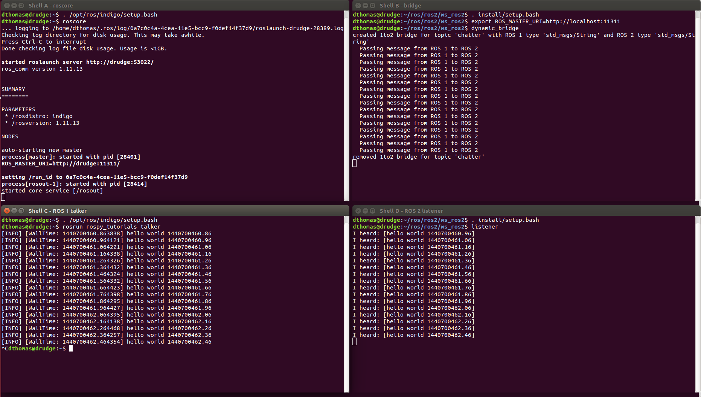

# Bridge communication between ROS 1 and ROS 2

This package provides a network bridge which enables the exchange of messages between ROS 1 and ROS 2.

The bridge is currently implemented in C++ as at the time the Python API for ROS 2 had not been developed.
Because of this its support is limited to only the message/service types available at compile time of the bridge.
The bridge provided with the prebuilt ROS 2 binaries includes support for common ROS interfaces (messages/services), such as the interface packages listed in the [ros2/common_interfaces repository](https://github.com/ros2/common_interfaces) and `tf2_msgs`.
See [the documentation](doc/index.rst) for more details on how ROS 1 and ROS 2 interfaces are associated with each other.
If you would like to use a bridge with other interfaces (including your own custom types), you will have to build the bridge from source (instructions below), after building and sourcing your custom types in separate ROS 1 and ROS 2 workspaces.
See [the documentation](doc/index.rst) for an example setup.

For efficiency reasons, topics will only be bridged when matching publisher-subscriber pairs are active for a topic on either side of the bridge.
As a result using `ros2 topic echo <topic-name>` doesn't work but fails with an error message `Could not determine the type for the passed topic` if no other subscribers are present since the dynamic bridge hasn't bridged the topic yet.
As a workaround the topic type can be specified explicitly `ros2 topic echo <topic-name> <topic-type>` which triggers the bridging of the topic since the `echo` command represents the necessary subscriber.
On the ROS 1 side `rostopic echo` doesn't have an option to specify the topic type explicitly.
Therefore it can't be used with the dynamic bridge if no other subscribers are present.
As an alternative you can use the `--bridge-all-2to1-topics` option to bridge all ROS 2 topics to ROS 1 so that tools such as `rostopic echo`, `rostopic list` and `rqt` will see the topics even if there are no matching ROS 1 subscribers.
Run `ros2 run ros1_bridge dynamic_bridge -- --help` for more options.

## Prerequisites

In order to run the bridge you need to either:

* get [prebuilt binaries](https://github.com/ros2/ros2/releases) or
* build the bridge as well as the other ROS 2 packages from source.

After that you can run both examples described below.

For all examples you need to source the environment of the install space where the bridge was built or unpacked to.
Additionally you will need to either source the ROS 1 environment or at least set the `ROS_MASTER_URI` and run a `roscore`.

The following ROS 1 packages are required to build and use the bridge:
* `catkin`
* `roscpp`
* `roslaunch` (for `roscore` executable)
* `rosmsg`
* `std_msgs`
* as well as the Python package `rospkg`

To run the following examples you will also need these ROS 1 packages:
* `rosbash` (for `rosrun` executable)
* `roscpp_tutorials`
* `rospy_tutorials`
* `rostopic`
* `rqt_image_view`

### Prerequisites for the examples in this file

In order to make the examples below portable between versions of ROS, we define two environment variables, `ROS1_INSTALL_PATH` and `ROS2_INSTALL_PATH`. 
These are defined as the paths to the installation location of their respective ROS versions.

If you installed Noetic in the default location, then the definition of `ROS1_INSTALL_PATH` will be `/opt/ros/noetic`.

Building the bridge as described below requires you to build all of ROS 2.
We assume that you have downloaded it to `~/ros2_rolling`, and that is where you plan on building it.
In this case, `ROS2_INSTALL_PATH` will be defined as `~/ros2_rolling/install`.

If you've chosen to install either or both versions of ROS somewhere else, you will need adjust the definitions below to match your installation paths.

Because these definitions are used continuously throughout this page, it is useful to add the following lines to your shell startup file (`~/.bashrc` if you are using `bash`, `~/.zshrc` if you are using `zsh`).
Modify these definitions as appropriate for the versions of ROS that you're using, and for the shell that you're using.


```bash
export ROS1_INSTALL_PATH=/opt/ros/noetic
export ROS2_INSTALL_PATH=~/ros2_rolling/install
```

Note that no trailing '/' character is used in either definition.
If you have problems involving paths, please verify that you have the correct path to the installation location, and that you do not have a trailing '/' in either definition.

### Building the bridge from source

Before continuing you should have the prerequisites for building ROS 2 from source installed following [these instructions](https://github.com/ros2/ros2/wiki/Installation).

In the past, building this package required patches to ROS 1, but in the latest releases that is no longer the case.
If you run into trouble first make sure you have at least version `1.11.16` of `ros_comm` and `rosbag`.

The bridge uses `pkg-config` to find ROS 1 packages.
ROS 2 packages are found through CMake using `find_package()`.
Therefore the `CMAKE_PREFIX_PATH` must not contain paths from ROS 1 which would overlay ROS 2 packages.

Here are the steps for Linux and OSX.

You should first build everything but the ROS 1 bridge with normal colcon arguments.
We don't recommend having your ROS 1 environment sourced during this step as it can add other libraries to the path.


```bash
colcon build --symlink-install --packages-skip ros1_bridge
```

Next you need to source the ROS 1 environment.
If you set the `ROS1_INSTALL_PATH` environment variable as described above, then the following will source the correct `setup.bash` file.


```bash
source ${ROS1_INSTALL_PATH}/setup.bash
# Or, on OSX, something like:
# . ~/ros_catkin_ws/install_isolated/setup.bash
```

The bridge will be built with support for any message/service packages that are on your path and have an associated mapping between ROS 1 and ROS 2.
Therefore you must add any ROS 1 or ROS 2 workspaces that have message/service packages that you want to be bridged to your path before building the bridge.
This can be done by adding explicit dependencies on the message/service packages to the `package.xml` of the bridge, so that `colcon` will add them to the path before it builds the bridge.
Alternatively you can do it manually by sourcing the relevant workspaces yourself, e.g.:


```bash
# You have already sourced your ROS installation.
# Source your ROS 2 installation:
source ${ROS2_INSTALL_PATH}/setup.bash
# And if you have a ROS 1 overlay workspace, something like:
# . <install-space-to-ros1-overlay-ws>/setup.bash
# And if you have a ROS 2 overlay workspace, something like:
# . <install-space-to-ros2-overlay-ws>/local_setup.bash
```

Then build just the ROS 1 bridge:


```bash
colcon build --symlink-install --packages-select ros1_bridge --cmake-force-configure
```

*Note:* If you are building on a memory constrained system you might want to limit the number of parallel jobs by setting e.g. the environment variable `MAKEFLAGS=-j1`.


## Example 1: run the bridge and the example talker and listener

The talker and listener can be either a ROS 1 or a ROS 2 node.
The bridge will pass the message along transparently.

*Note:* When you are running these demos make sure to only source the indicated workspaces.
You will get errors from most tools if they have both workspaces in their environment.


### Example 1a: ROS 1 talker and ROS 2 listener

First we start a ROS 1 `roscore`:


```bash
# Shell A (ROS 1 only):
source ${ROS1_INSTALL_PATH}/setup.bash
# Or, on OSX, something like:
# . ~/ros_catkin_ws/install_isolated/setup.bash
roscore
```

---

Then we start the dynamic bridge which will watch the available ROS 1 and ROS 2 topics.
Once a *matching* topic has been detected it starts to bridge the messages on this topic.


```bash
# Shell B (ROS 1 + ROS 2):
# Source ROS 1 first:
source ${ROS1_INSTALL_PATH}/setup.bash
# Or, on OSX, something like:
# . ~/ros_catkin_ws/install_isolated/setup.bash
# Source ROS 2 next:
source ${ROS2_INSTALL_PATH}/setup.bash
# For example:
# . /opt/ros/dashing/setup.bash
export ROS_MASTER_URI=http://localhost:11311
ros2 run ros1_bridge dynamic_bridge
```

The program will start outputting the currently available topics in ROS 1 and ROS 2 in a regular interval.

---

Now we start the ROS 1 talker.


```bash
# Shell C:
source ${ROS1_INSTALL_PATH}/setup.bash
# Or, on OSX, something like:
# . ~/ros_catkin_ws/install_isolated/setup.bash
rosrun rospy_tutorials talker
```

The ROS 1 node will start printing the published messages to the console.

---

Now we start the ROS 2 listener from the `demo_nodes_cpp` ROS 2 package.


```bash
# Shell D:
source ${ROS2_INSTALL_PATH}/setup.bash
ros2 run demo_nodes_cpp listener
```

The ROS 2 node will start printing the received messages to the console.

When looking at the output in *shell B* there will be a line stating that the bridge for this topic has been created:


```bash
created 1to2 bridge for topic '/chatter' with ROS 1 type 'std_msgs/String' and ROS 2 type 'std_msgs/String'
```

At the end stop all programs with `Ctrl-C`.
Once you stop either the talker or the listener in *shell B* a line will be stating that the bridge has been torn down:


```bash
removed 1to2 bridge for topic '/chatter'
```

The screenshot shows all the shell windows and their expected content:




### Example 1b: ROS 2 talker and ROS 1 listener

The steps are very similar to the previous example and therefore only the commands are described.


```bash
# Shell A:
source ${ROS1_INSTALL_PATH}/setup.bash
# Or, on OSX, something like:
# . ~/ros_catkin_ws/install_isolated/setup.bash
roscore
```

---


```bash
# Shell B:
source ${ROS1_INSTALL_PATH}/setup.bash
# Or, on OSX, something like:
# . ~/ros_catkin_ws/install_isolated/setup.bash
source ${ROS2_INSTALL_PATH}/setup.bash
export ROS_MASTER_URI=http://localhost:11311
ros2 run ros1_bridge dynamic_bridge
```

---

Now we start the ROS 2 talker from the `demo_nodes_py` ROS 2 package.

```bash
# Shell C:
source ${ROS2_INSTALL_PATH}/setup.bash
ros2 run demo_nodes_py talker
```

---

Now we start the ROS 1 listener.

```bash
# Shell D:
source ${ROS1_INSTALL_PATH}/setup.bash
# Or, on OSX, something like:
# . ~/ros_catkin_ws/install_isolated/setup.bash
rosrun roscpp_tutorials listener
```

## Example 2: run the bridge and exchange images

The second example will demonstrate the bridge passing along bigger and more complicated messages.
A ROS 2 node is publishing images retrieved from a camera and on the ROS 1 side we use `rqt_image_view` to render the images in a GUI.
And a ROS 1 publisher can send a message to toggle an option in the ROS 2 node.

First we start a ROS 1 `roscore` and the bridge:

```bash
# Shell A:
source ${ROS1_INSTALL_PATH}/setup.bash
# Or, on OSX, something like:
# . ~/ros_catkin_ws/install_isolated/setup.bash
roscore
```

```bash
# Shell B:
source ${ROS1_INSTALL_PATH}/setup.bash
# Or, on OSX, something like:
# . ~/ros_catkin_ws/install_isolated/setup.bash
source ${ROS2_INSTALL_PATH}/install/setup.bash
export ROS_MASTER_URI=http://localhost:11311
ros2 run ros1_bridge dynamic_bridge
```

---

Now we start the ROS 1 GUI:

```bash
# Shell C:
source ${ROS1_INSTALL_PATH}/setup.bash
# Or, on OSX, something like:
# . ~/ros_catkin_ws/install_isolated/setup.bash
rqt_image_view /image
```

---

Now we start the ROS 2 image publisher from the `image_tools` ROS 2 package:
```bash
# Shell D:
source ${ROS2_INSTALL_PATH}/install/setup.bash
ros2 run image_tools cam2image
```

You should see the current images in `rqt_image_view` which are coming from the ROS 2 node `cam2image` and are being passed along by the bridge.

---

To exercise the bridge in the opposite direction at the same time you can publish a message to the ROS 2 node from ROS 1.
By publishing either `true` or `false` to the `flip_image` topic, the camera node will conditionally flip the image before sending it.
You can either use the `Message Publisher` plugin in `rqt` to publish a `std_msgs/Bool` message on the topic `flip_image`, or run one of the two following `rostopic` commands:


```bash
# Shell E:
source ${ROS1_INSTALL_PATH}/setup.bash
# Or, on OSX, something like:
# . ~/ros_catkin_ws/install_isolated/setup.bash
rostopic pub -r 1 /flip_image std_msgs/Bool "{data: true}"
rostopic pub -r 1 /flip_image std_msgs/Bool "{data: false}"
```

The screenshot shows all the shell windows and their expected content (it was taken when Indigo was supported - you should use Melodic):


## Example 3: run the bridge for AddTwoInts service

In this example we will bridge a service TwoInts from
[ros/roscpp_tutorials](https://github.com/ros/ros_tutorials) and AddTwoInts from
[ros2/roscpp_examples](https://github.com/ros2/examples).

While building, ros1_bridge looks for all installed ROS and ROS2 services.
Found services are matched by comparing package name, service name and fields in a request and a response.
If all names are the same in ROS and ROS2 service, the bridge will be created.
It is also possible to pair services manually by creating a yaml file that will include names of corresponding services.
You can find more information [here](doc/index.rst).

So to make this example work, please make sure that the roscpp_tutorials package
is installed on your system and the environment is set up correctly while you build ros1_bridge.

Launch ROS master

```bash
# Shell A:
source ${ROS1_INSTALL_PATH}/setup.bash
roscore -p 11311
```

Launch dynamic_bridge:

```bash
# Shell B:
source ${ROS1_INSTALL_PATH}/setup.bash
source ${ROS2_INSTALL_PATH}/setup.bash
export ROS_MASTER_URI=http://localhost:11311
ros2 run ros1_bridge dynamic_bridge
```

Launch TwoInts server:

```bash
# Shell C:
source ${ROS1_INSTALL_PATH}/setup.bash
export ROS_MASTER_URI=http://localhost:11311
rosrun roscpp_tutorials add_two_ints_server
```

Launch AddTwoInts client:

```bash
# Shell D:
source ${ROS2_INSTALL_PATH}/setup.bash
ros2 run demo_nodes_cpp add_two_ints_client
```

## Example 4: bridge only selected topics and services
This example expands on example 3 by selecting a subset of topics and services to be bridged.
This is handy when, for example, you have a system that runs most of it's stuff in either ROS 1 or ROS 2 but needs a few nodes from the 'opposite' version of ROS.
Where the `dynamic_bridge` bridges all topics and service, the `parameter_bridge` uses the ROS 1 parameter server to choose which topics and services are bridged.
**Note**: The service bridge is **monodirectional**. You must use either `services_2_to_1` and/or `services_1_to_2` to bridge ROS 2 -> ROS 1 or ROS 1 -> ROS 2 services accordingly.
For example, to bridge only the `/chatter` topic bidirectionally, and the `/add_two_ints service` from ROS 2 to ROS 1 only, create this configuration file, `bridge.yaml`:

```yaml
topics:
  -
    topic: /chatter  # Topic name on both ROS 1 and ROS 2
    type: std_msgs/msg/String  # Type of topic to bridge
    queue_size: 1  # Queue size
services_2_to_1:
  -
    service: /add_two_ints  # ROS 1 service name
    type: roscpp_tutorials/TwoInts  # The ROS 1 service type name
```

Start a ROS 1 roscore:

```bash
# Shell A (ROS 1 only):
source ${ROS1_INSTALL_PATH}/setup.bash
# Or, on OSX, something like:
# . ~/ros_catkin_ws/install_isolated/setup.bash
roscore
```

Then load the bridge.yaml config file and start the talker to publish on the `/chatter` topic:

```bash
Shell B: (ROS 1 only):
source ${ROS1_INSTALL_PATH}/setup.bash
# Or, on OSX, something like:
# . ~/ros_catkin_ws/install_isolated/setup.bash
rosparam load bridge.yaml

rosrun rospy_tutorials talker
```

```bash
Shell C: (ROS 1 only):
source ${ROS1_INSTALL_PATH}/setup.bash
# Or, on OSX, something like:
# . ~/ros_catkin_ws/install_isolated/setup.bash

rosrun roscpp_tutorials add_two_ints_server
```

Then, in a few ROS 2 terminals:

```bash
# Shell D:
source ${ROS2_INSTALL_PATH}/setup.bash
ros2 run ros1_bridge parameter_bridge
```

If all is well, the logging shows it is creating bridges for the topic and service and you should be able to call the service and listen to the ROS 1 talker from ROS 2:

```bash
# Shell E:
source ${ROS2_INSTALL_PATH}/setup.bash
ros2 run demo_nodes_cpp listener
```
This should start printing text like `I heard: [hello world ...]` with a timestamp.

```bash
# Shell F:
source ${ROS2_INSTALL_PATH}/setup.bash
ros2 service call /add_two_ints example_interfaces/srv/AddTwoInts "{a: 1, b: 2}"
```
If all is well, the output should contain `example_interfaces.srv.AddTwoInts_Response(sum=3)`

### Parametrizing Quality of Service
An advantage of ROS 2 over ROS 1 is the possibility to define different Quality of Service settings per topic.
The parameter bridge optionally allows for this as well.
For some topics, like `/tf_static` this is actually required, as this is a latching topic in ROS 1.
In ROS 2 with the `parameter_bridge`, this requires that topic to be configured as such:

```yaml
topics:
  -
    topic: /tf_static
    type: tf2_msgs/msg/TFMessage
    queue_size: 1
    qos:
      history: keep_all
      durability: transient_local
```

All other QoS options (as documented here in https://docs.ros.org/en/foxy/Concepts/About-Quality-of-Service-Settings.html) are available:

```yaml
topics:
  -
    topic: /some_ros1_topic
    type: std_msgs/msg/String
    queue_size: 1
    qos:
      history: keep_last  # OR keep_all, then you can omit `depth` parameter below
      depth: 10  # Only required when history == keep_last
      reliability: reliable  # OR best_effort
      durability: transient_local  # OR volatile
      deadline:
          secs: 10
          nsecs: 2345
      lifespan:
          secs: 20
          nsecs: 3456
      liveliness: liveliness_system_default  # Values from https://design.ros2.org/articles/qos_deadline_liveliness_lifespan.html, eg. LIVELINESS_AUTOMATIC
      liveliness_lease_duration:
          secs: 40
          nsecs: 5678
```

Note that the `qos` section can be omitted entirely and options not set are left default.
